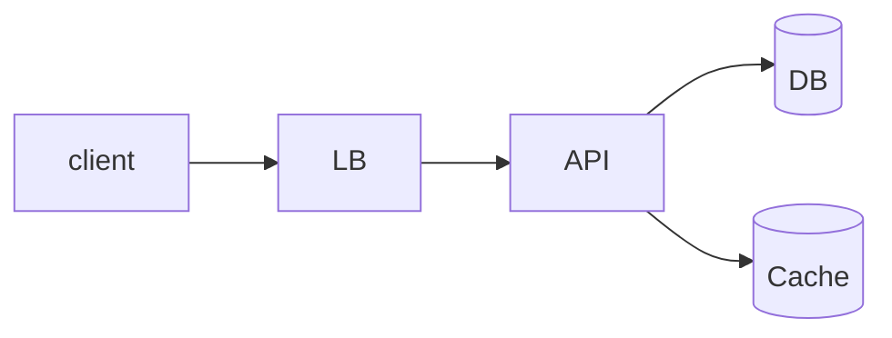

# <System Name>

> "Design <X>." — the one-line ask, as it gets dropped on you.

## 1. Requirements (5 min)

**Functional:** the 3–4 things it must do. Everything else is explicitly out of scope —
say what you're cutting and get agreement.

**Non-functional:** availability vs consistency, latency target, durability.

**Scale:** DAU, read:write ratio, payload size → QPS and storage/year. Do the arithmetic
out loud; round aggressively.

## 2. API

```
POST /resource   {...} -> 201 {id}
GET  /resource?cursor=  -> {items, next}
```

## 3. Data model

Entities, keys, and the access patterns each index exists to serve. Pick the store per
entity and justify it — "Postgres because I need a transaction here, blob store for the
payload because it's 5 MB and never queried."

## 4. High-level design



## 5. Deep dive

The one hard part. Pick it before they do: the fan-out, the hot key, the exactly-once,
the ranking, the geo-index.

## 6. Bottlenecks & tradeoffs

Hot shards, cache stampede, thundering herd, backpressure. What breaks first at 10×, and
the specific thing you'd do about it.

## What I missed
